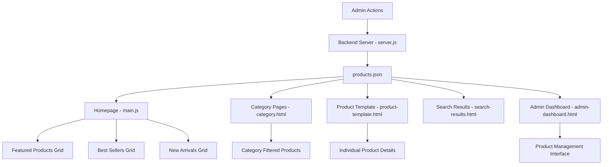

# 🎛️ Admin Dashboard Analysis & Improvement Plan

## 📊 **Current System Overview**

### **How Products Flow from JSON to Pages:**



### **Current JSON Structure:**
```json
{
  "id": 1,
  "name": "Gaming Controller",
  "price": 119.99,
  "originalPrice": 149.99,
  "discount": 20,
  "image": "assets/images/products-organized/1-gaming-controller/1-main.jpg",
  "images": [
    "assets/images/products-organized/1-gaming-controller/1-main.jpg",
    "assets/images/products-organized/1-gaming-controller/2-angle.jpg",
    "assets/images/products-organized/1-gaming-controller/3-detail.jpg",
    "assets/images/products-organized/1-gaming-controller/4-context.jpg",
    "assets/images/products-organized/1-gaming-controller/5-package.jpg"
  ],
  "link": "product-template.html?id=1",
  "category": "Controllers",
  "description": "Premium Bluetooth gaming controller...",
  "stock": 8,
  "rating": 4.8,
  "reviews": 234,
  "features": [...]
}
```

## 🔧 **Current Admin Dashboard Features**

### ✅ **Working Features:**
1. **Authentication**: Admin-only access with Supabase auth
2. **Product Display**: Grid view with thumbnails and prices
3. **Product Editing**: Click-to-edit modal with basic fields
4. **Statistics**: Product count, user count, order count
5. **Order Management**: View orders and messaging
6. **User Messaging**: Broadcast messages to all users

### ❌ **Current Issues:**

#### **1. Missing Backend Server**
- **Problem**: Admin dashboard expects endpoints `/add-product` and `/edit-product`
- **Current Status**: These endpoints exist in `server.js` but server is not running
- **Impact**: Cannot add or edit products from admin dashboard

#### **2. Image Management Problems**
- **Problem**: Admin form still expects old image structure
- **Current**: Admin form has 5 image URL/file inputs
- **Issue**: Not integrated with new organized image folder structure
- **Impact**: New products won't follow the organized image naming convention

#### **3. Limited Product Editing**
- **Problem**: Edit modal only shows main image field, not all 5 images
- **Missing**: Can't edit all product images, features, stock, rating, etc.
- **Impact**: Incomplete product management

#### **4. No Product Deletion**
- **Problem**: No way to delete products from admin panel
- **Impact**: Cannot remove discontinued products

#### **5. No Image Preview**
- **Problem**: No preview of images when adding/editing
- **Impact**: Hard to verify correct images are being used

## 🚀 **Improvement Plan**

### **Phase 1: Backend Setup** 🔧
```bash
# 1. Install dependencies
npm install express multer cors path fs

# 2. Run the backend server
node server.js

# 3. Server will run on http://localhost:3000
```

### **Phase 2: Image Integration** 📸

#### **Update Admin Dashboard to Work with Organized Images:**
1. **Auto-generate image paths** based on product name
2. **Create product folder** automatically when adding products
3. **Image upload handling** to correct organized folders
4. **Image preview** functionality

### **Phase 3: Enhanced Product Management** ⚡

#### **Add Missing Features:**
1. **Full product editing** (all 5 images, features, stock, rating)
2. **Product deletion** with confirmation
3. **Bulk operations** (delete multiple, bulk edit)
4. **Image management** (upload, replace, reorder)
5. **Product validation** (ensure all required fields)

### **Phase 4: UX Improvements** ✨

#### **Better User Experience:**
1. **Drag & drop image upload**
2. **Real-time preview** of product cards
3. **Search and filter** products in admin
4. **Duplicate product** functionality
5. **Import/Export** products

## 🛠️ **Immediate Solutions**

### **Quick Fix 1: Start Backend Server**
```bash
cd "C:\Users\Maxxiloh_\OneDrive\Pictures\gaming gear"
node server.js
```

### **Quick Fix 2: Update Image Paths in Admin Form**
- Modify admin form to use organized image structure
- Auto-generate folder names from product names
- Handle image uploads to correct directories

### **Quick Fix 3: Enhanced Edit Modal**
- Add all 5 image fields to edit modal
- Include missing fields (stock, rating, features)
- Add image preview functionality

## 📈 **Expected Results After Improvements**

### **Admin Will Be Able To:**
1. ✅ **Add new products** with automatic image organization
2. ✅ **Edit all product fields** including all 5 images
3. ✅ **Delete products** safely
4. ✅ **Preview changes** before saving
5. ✅ **Manage images** easily with drag & drop
6. ✅ **See real-time updates** on the website

### **Website Will:**
1. ✅ **Automatically display new products** on all pages
2. ✅ **Update product information** instantly
3. ✅ **Show organized images** correctly
4. ✅ **Maintain consistent product links**

## 🎯 **Next Steps**

1. **Start the backend server** (`node server.js`)
2. **Test current functionality** with server running
3. **Implement image organization integration**
4. **Enhance the edit modal** with all fields
5. **Add product deletion** functionality
6. **Test end-to-end workflow**

---

**Ready to implement these improvements! Which part would you like to tackle first?** 🚀
