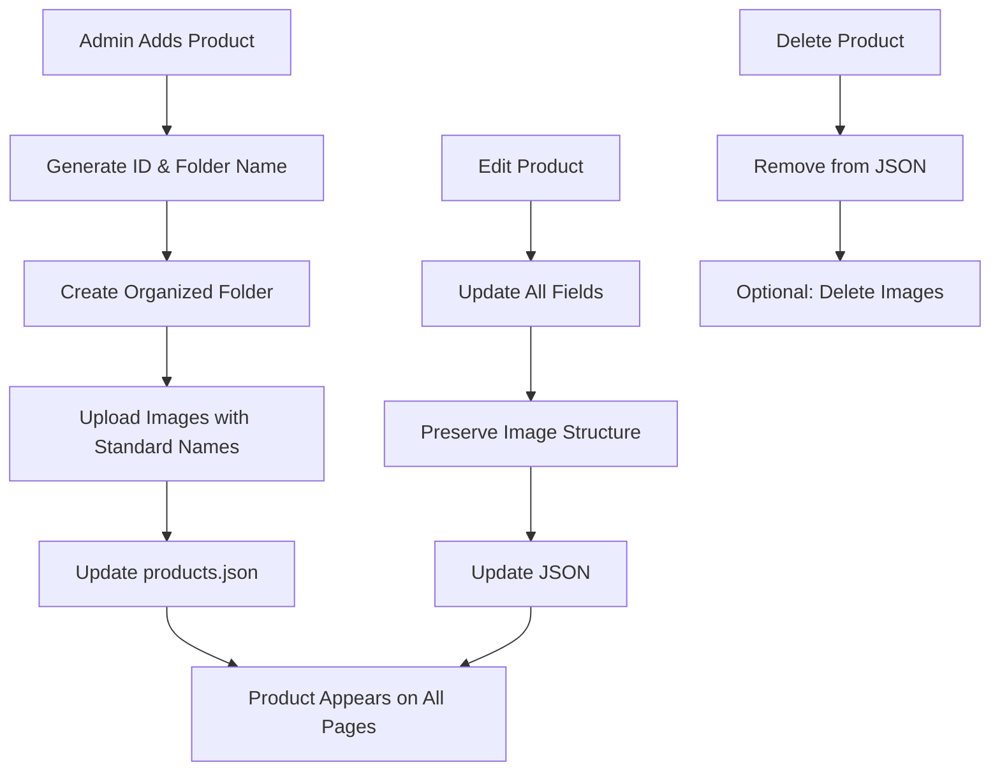

# 🚀 Enhanced Admin Dashboard Setup Guide

## ✅ **What's Been Updated**

### **1. Admin Dashboard Features**
- ✅ **Organized Image Structure Integration**
- ✅ **Enhanced Product Adding** (name, category, price, discount, stock, rating, reviews, features)
- ✅ **Complete Product Editing** (all fields including 5 images)
- ✅ **Product Deletion** with confirmation
- ✅ **Image Previews** during upload
- ✅ **Form Validation** and user feedback
- ✅ **Auto-generated folder names** for products

### **2. Backend Enhancements**
- ✅ **New Endpoint**: `/add-product-organized` - Creates products with organized image structure
- ✅ **New Endpoint**: `/edit-product-enhanced` - Full product editing
- ✅ **New Endpoint**: `/delete-product` - Safe product deletion
- ✅ **Automatic Folder Creation** for product images
- ✅ **Organized Image Naming** (1-main.jpg, 2-angle.jpg, etc.)

## 🛠️ **How to Start Using**

### **Step 1: Start the Backend Server**
```bash
# Navigate to your project root
cd "C:\Users\Maxxiloh_\OneDrive\Pictures\gaming gear"

# Install dependencies (if not already done)
npm install express multer cors path fs

# Start the server
node server.js
```

**Expected Output:**
```
Backend server running at http://localhost:3000
```

### **Step 2: Access Admin Dashboard**
1. Open your browser
2. Go to: `file:///C:/Users/Maxxiloh_/OneDrive/Pictures/gaming%20gear/mobile-gaming-store/admin-dashboard.html`
3. Login with your admin credentials

## 🎯 **How to Use New Features**

### **Adding Products**
1. **Fill Product Details**:
   - Product Name (will auto-generate folder name)
   - Price, Discount, Category
   - Stock, Rating, Review count
   - Description and Features

2. **Upload Images**:
   - Required: At least 1-main.jpg
   - Optional: 2-angle.jpg, 3-detail.jpg, 4-context.jpg, 5-package.jpg
   - Images will auto-preview before upload

3. **Submit**: Product will be created with organized structure

### **Editing Products**
1. **Click any product card** to open edit modal
2. **Modify any field** (name, price, stock, features, etc.)
3. **View all 5 current images**
4. **Save Changes** or **Delete Product**

### **Organized Image Structure**
- **Auto-created folders**: `assets/images/products-organized/[ID]-[product-name]/`
- **Standardized naming**: `1-main.jpg`, `2-angle.jpg`, etc.
- **Automatic JSON updates** with correct paths

## 📊 **Product Flow After Update**



## 🎨 **New Admin Dashboard UI**

### **Enhanced Add Product Form**
- **Grid layout** for better organization
- **Category dropdown** with suggestions
- **Image upload boxes** with previews
- **Features textarea** (one per line)
- **Smart validation** with visual feedback

### **Enhanced Edit Modal**
- **All product fields** editable
- **Image management** section
- **Delete button** with confirmation
- **Real-time validation**

### **Visual Improvements**
- **Hover effects** on product cards ("Click to Edit")
- **Image previews** during upload
- **Better form layout** with grid system
- **Status indicators** and loading states

## ⚡ **Backend Endpoints**

### **New Organized Endpoints**
- `POST /add-product-organized` - Add with organized images
- `POST /edit-product-enhanced` - Edit with all fields
- `POST /delete-product` - Delete product safely

### **Legacy Endpoints (Still Work)**
- `POST /add-product` - Original add product
- `POST /edit-product` - Basic edit product

## 🔧 **Expected JSON Structure**

**New products will have this complete structure:**
```json
{
  "id": 1672844400000,
  "name": "Premium Gaming Controller",
  "category": "Controllers",
  "price": 79.99,
  "originalPrice": 99.99,
  "discount": 20,
  "stock": 15,
  "rating": 4.8,
  "reviews": 127,
  "image": "assets/images/products-organized/1672844400000-premium-gaming-controller/1-main.jpg",
  "images": [
    "assets/images/products-organized/1672844400000-premium-gaming-controller/1-main.jpg",
    "assets/images/products-organized/1672844400000-premium-gaming-controller/2-angle.jpg",
    "assets/images/products-organized/1672844400000-premium-gaming-controller/3-detail.jpg",
    "assets/images/products-organized/1672844400000-premium-gaming-controller/4-context.jpg",
    "assets/images/products-organized/1672844400000-premium-gaming-controller/5-package.jpg"
  ],
  "link": "product-template.html?id=1672844400000",
  "description": "Premium wireless gaming controller...",
  "features": [
    "Bluetooth Connectivity",
    "Long Battery Life",
    "Customizable Buttons"
  ]
}
```

## 🎉 **Ready to Use!**

Your admin dashboard now has:
- ✅ **Full product management** (add, edit, delete)
- ✅ **Organized image structure** integration
- ✅ **Enhanced user interface**
- ✅ **Backend API** ready
- ✅ **Automatic website updates**

**Start the server and begin managing your products!** 🚀
